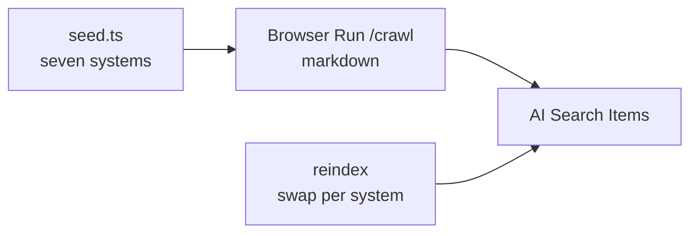
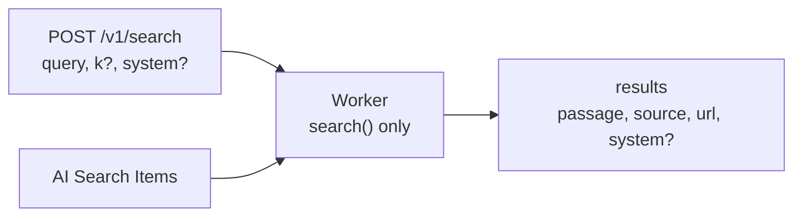

# Architecture

Cited retrieval over indexed design-system docs. The worker returns stored passages. It does not write them.

## Seed to crawl to index



Seed ids: `paste`, `primer`, `uswds`, `govuk`, `nhs`, `antd`, `gitlab-pajamas`. One docs-root `startUrl` each.

Crawl: `source=all`, limit and depth `100000`, `formats: [markdown]`, `render: true`. `hitLimit` must be false. Host-scope only. No page-list filters.

Reindex runs on config change. Upload the new generation for a system, then delete the previous one. Ids not in the seed are deleted. An empty search is not deletion.

## Query to citation JSON



`query` required. `k` default 8, max 20. `system` optional, a seed id.

```json
{ "results": [{ "passage": "…", "source": "Primer", "url": "https://…", "system": "primer" }] }
```

`passage` is the chunk text, verbatim. `url` is the page https URL. `source` is the label. `system` is the seed id.

No matches: `{ "results": [] }`. Missing query: `400` `{ "error": "query_required" }`.

The query path calls `search()` only. No rewrite. No chat completions.

`GET /health` is `200` when the index is ready.
