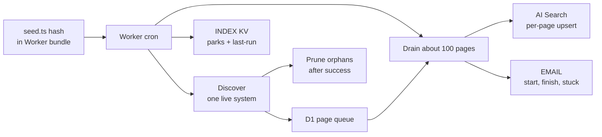
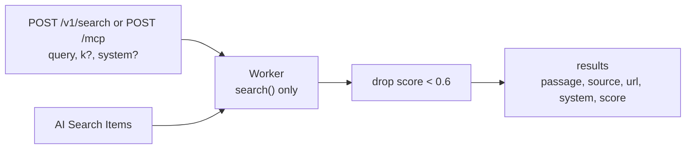

# Architecture

Cited retrieval over indexed design-system docs. The worker returns stored passages. It does not write them.

## Seed to queue to index


```mermaid
flowchart LR
  seed["seed.ts hash\nin Worker bundle"] --> cron["Worker cron"]
  cron --> discover["Discover\none live system"]
  discover --> queue["D1 page queue"]
  discover --> prune["Prune orphans\nafter success"]
  cron --> drain["Drain about 100 pages"]
  queue --> drain
  drain --> items["AI Search\nper-page upsert"]
  cron --> kv["INDEX KV\nparks + last-run"]
  drain --> mail["EMAIL\nstart, finish, stuck"]
```

Seed ids: `paste`, `primer`, `uswds`, `govuk`, `nhs`, `antd`, `gitlab-pajamas`, `patternfly`, `cloudscape`, `vanilla`, `siemens-ix`, `backpack`, `garden`, `ouds-web`. One `startUrl` each.

The happy path is continuous fill. Each cron tick discovers URLs for at most one system and drains a small batch of page work. It does not crawl and swap a whole site inside one Workflow run. Parks stay on INDEX KV. The page queue is D1 (`PAGE_QUEUE`): one row per `(systemId, url)` with `kind` (`seed` or `reindex`), `enqueuedAt`, `attempts`, `lastCrawled`, and `lastIndexed`. Rediscovery upserts that row and keeps those timestamps. `seed` stays ahead of `reindex`.

Discover reuses the Browser Run `/crawl` request (`source=all`, limit `500`, depth `500`, markdown, render). A tick only starts or continues one job. Parks do not take that slot. Seed drift is chosen before a due recheck, and a system with pages still pending or claimed is not discovered again. A system is due when `lastIndexed` is missing or older than 30 days, it has no queued pages, and it was not discovered in that window. The Sunday 06:00 UTC cron discovers one parked seed, rotating to the least recently attempted parked system. While the crawl is still running, the tick only polls. After it completes, later ticks page through records. Every https URL in those records is the live map. Usable pages are the ones that pass the existing usable-page check. A finished crawl with fewer than two usable URLs is a stub: it parks the system, drops that system's queue rows so older completions cannot unpark it, and does not prune. A crawl that errors or hits the page cap does not prune and does not replace the queue.

A successful discover enqueues only the usable URLs. It then deletes AI Search docs and queue rows for that system whose URL is not on the live map. A URL that was crawled but not usable keeps its previous searchable doc. URLs still on the map stay: indexed rows keep their timestamps, queued rows drain, failed rows retry. The seed hash is written when drain has indexed that system with nothing left pending, claimed, or failed. Enqueue does not mark the seed current. Docs already in AI Search stay searchable. Drain never deletes a previous page unless the replacement upload has succeeded.

Drain claims up to 100 pages per tick: `seed` first, then oldest `lastIndexed` (missing first), then oldest `enqueuedAt`. Each claim is owned by its attempt and `claimedAt`. A later tick can reclaim a row after 15 minutes, and the older tick's complete or fail does not apply. Each claimed page is fetched with Browser Run `/markdown` and upserted into AI Search with `lastCrawled` and `lastIndexed` on the item. After that upload, older items for the same URL are deleted so one version remains. A failed fetch or upload marks that work item failed and leaves the previous doc in place. Pages already upserted are searchable while the rest of the system is still queued. A system leaves the park map once two pages are indexed, except a system parked earlier in the same tick.

`GET /v1/index-status` returns the last-run JSON plus queue depths (`pending`, `claimed`, `failed`, `done`) and per-system `lastCrawled`, `lastIndexed`, and `lastDiscovered`. The worker emails `simon.taggart@gmail.com` when a discover starts, when a discover finishes or parks, and when a drain tick claims pages but indexes none or the failed set is stuck. When nothing is pending or claimed and failed rows remain, status is `fail` with the same stuck error the mail uses. A tick that indexes at least one page does not send fail mail while other pages remain queued. `ReindexWorkflow` is still in the bundle from the earlier whole-site path and is not what the cron starts. If one of those instances is still running, the cron waits instead of starting a second crawl. `bun run reindex` stays debug-only.

## Query to citation JSON


```mermaid
flowchart LR
  q["POST /v1/search or POST /mcp\nquery, k?, system?"] --> worker["Worker\nsearch() only"]
  items["AI Search Items"] --> worker
  worker --> filter["drop score < 0.6"]
  filter --> json["results\npassage, source, url, system, score"]
```

`query` required. `k` default 8, max 20. `system` optional, a seed id. `POST /mcp` is Streamable HTTP MCP on the same worker. `@modelcontextprotocol/server` `createMcpHandler` owns the JSON-RPC envelope. `tools/call` for `search_design_guidance` uses the same parse and `searchCitations` path as `/v1/search`. It does not loop back over HTTP. Install steps for Cursor, Claude Code, and Codex live in the [root README](../README.md).

```json
{ "results": [{ "passage": "…", "source": "Primer", "url": "https://…", "system": "primer", "score": 0.72 }] }
```

`passage` is the chunk text, verbatim. `url` is the page https URL. `source` is the label. `system` is the seed id. `score` is the AI Search chunk score, passed through. The worker drops hits with `score` < 0.6 before the response.

No matches after the filter: `{ "results": [] }`. Missing query: `400` `{ "error": "query_required" }`.

The query path calls `search()` only. No rewrite. No chat completions.

The golden query is `accessible combobox or listbox keyboard and focus guidance`. A pass is HTTP 200 with at least two distinct `system` values. Each hit has `passage`, `source`, `url`, and `score` of 0.6 or greater. A human spot-check confirms the passages are about combobox or listbox keyboard and focus accessibility.

`GET /health` is `200` when the index is ready. `GET /v1/index-status` is last-run health plus the live page queue: depths, per-system `lastCrawled` / `lastIndexed` / `lastDiscovered`, parks, unparked ids, crawl/render/index errors, and the active discover id when a fill is running. Email is a push of start, finish, and stuck summaries, not a replacement for the pull endpoint. Mid-fill does not fail the status or the mail.
