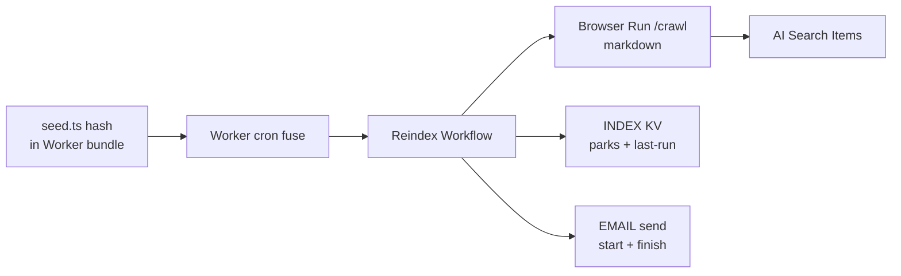
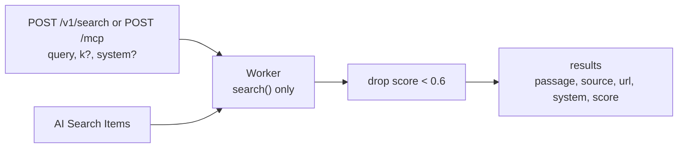

# Architecture

Cited retrieval over indexed design-system docs. The worker returns stored passages. It does not write them.

## Seed to crawl to index


```mermaid
flowchart LR
  seed["seed.ts hash\nin Worker bundle"] --> cron["Worker cron fuse"]
  cron --> workflow["Reindex Workflow"]
  workflow --> crawl["Browser Run /crawl\nmarkdown"]
  crawl --> items["AI Search Items"]
  workflow --> kv["INDEX KV\nparks + last-run"]
  workflow --> mail["EMAIL send\nstart + finish"]
```

Seed ids: `paste`, `primer`, `uswds`, `govuk`, `nhs`, `antd`, `gitlab-pajamas`, `patternfly`, `cloudscape`, `vanilla`, `siemens-ix`, `backpack`, `garden`, `ouds-web`. One `startUrl` each.

Crawl: `source=all`, limit and depth `100000`, `formats: [markdown]`, `render: true`. `hitLimit` must be false. `includePatterns` scopes the crawl when a seed sets them. No page-list filters.

A Cloudflare Workflow is the reindex engine. A 5-minute Worker cron compares the bundle seed hash to `lastIndexedHash` in KV and starts the Workflow for new or changed systems (`deploy-drift`). A daily cron recrawls non-parked seeds (`recrawl`). The Workflow polls Browser Run with `step.sleep`, then does the same per-system swap as `src/index/reindex.ts`. A completed crawl with fewer than two usable pages is a stub: it does not swap, and the Workflow writes park state to KV. Catalog, query, and the MCP skill enum read that park map and drop parked systems from the live set. `GET /v1/index-status` returns the last-run JSON. The Workflow emails `me@simontaggart.com` via `env.EMAIL.send({ from, to, subject, text })` on start and on finish (success or fail). That inbox must be a verified Email Routing destination (ops once). Finish mail includes systems, counts, parks, errors, and the status URL. Index swap commits before finish mail. `bun run reindex` stays debug-only.

## Query to citation JSON


```mermaid
flowchart LR
  q["POST /v1/search or POST /mcp\nquery, k?, system?"] --> worker["Worker\nsearch() only"]
  items["AI Search Items"] --> worker
  worker --> filter["drop score < 0.6"]
  filter --> json["results\npassage, source, url, system, score"]
```

`query` required. `k` default 8, max 20. `system` optional, a seed id. `POST /mcp` is Streamable HTTP MCP on the same worker. `@modelcontextprotocol/server` `createMcpHandler` owns the JSON-RPC envelope. `tools/call` for `search_design_guidance` uses the same parse and `searchCitations` path as `/v1/search`. It does not loop back over HTTP. Install steps for Cursor, Claude Code, and Codex live in the [root README](../README.md).

```json
{ "results": [{ "passage": "…", "source": "Primer", "url": "https://…", "system": "primer", "score": 0.72 }] }
```

`passage` is the chunk text, verbatim. `url` is the page https URL. `source` is the label. `system` is the seed id. `score` is the AI Search chunk score, passed through. The worker drops hits with `score` < 0.6 before the response.

No matches after the filter: `{ "results": [] }`. Missing query: `400` `{ "error": "query_required" }`.

The query path calls `search()` only. No rewrite. No chat completions.

The golden query is `accessible combobox or listbox keyboard and focus guidance`. A pass is HTTP 200 with at least two distinct `system` values. Each hit has `passage`, `source`, `url`, and `score` of 0.6 or greater. A human spot-check confirms the passages are about combobox or listbox keyboard and focus accessibility.

`GET /health` is `200` when the index is ready. `GET /v1/index-status` is last-run health: per-system counts, parks, crawl/render/index errors, and the workflow id. Email is a push of that same summary, not a replacement for the pull endpoint.
